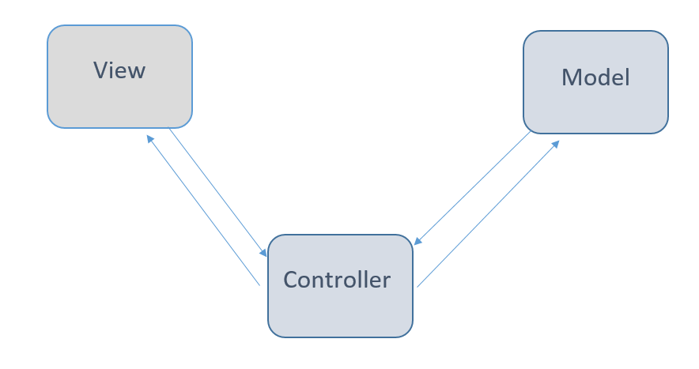

# MVC Pattern là gì?

MVC là viết tắt của Model-View-Controller (MVC), nó là một mẫu thiết kế phần mềm tách rời các mối quan tâm khác nhau trong một ứng dụng.

Đây là một cách mạnh mẽ và hiệu quả để thiết kế các ứng dụng phân tách logic UI (Giao diện người dùng) khỏi logic truy cập dữ liệu và thao tác dữ liệu. Việc tách biệt rõ ràng các mối quan tâm sẽ làm tăng thêm độ phức tạp cho thiết kế của ứng dụng, nhưng nó mang lại những lợi ích to lớn cho tính ổn định, chức năng và khả năng kiểm tra của ứng dụng.

# Tại sao nên sử dụng MVC Pattern?

MVC phân tách ứng dụng thành ba khía cạnh chính:

+ Model: Một tập hợp các lớp, về cơ bản là dữ liệu bạn đang làm việc cùng với các quy tắc và logic nghiệp vụ mô tả cách dữ liệu có thể được thao tác.
+ View: Nó xác định giao diện người dùng của ứng dụng, nói cách khác, nó là đại diện của dữ liệu mà Model chứa.
+ Controller: Một tập hợp các lớp xử lý đầu vào của người dùng và hoạt động dựa trên Model để tạo chế độ xem được yêu cầu.

Nếu bạn nhìn vào sơ đồ trên, Trong một mẫu thiết kế MVC điển hình. Người dùng cuối tương tác với Chế độ xem, về cơ bản là lớp Giao diện người dùng. Khi người dùng thực hiện hành động, người dùng nhấp vào bất kỳ nút hoặc sự kiện di chuột nào, Chế độ xem sẽ gọi Bộ điều khiển tương ứng. Bộ điều khiển sau đó xác định Model và cập nhật nó theo yêu cầu. Khi Model được cập nhật thì Bộ điều khiển tạo Chế độ xem và cập nhật nó cho người dùng cuối.

# Kiến trúc MVC

MVC là một mẫu kiến ​​trúc có nghĩa là nó quy định toàn bộ kiến ​​trúc của các ứng dụng. Mặc dù nó thường được gọi là mẫu thiết kế nhưng chúng ta có thể sai nếu chúng ta chỉ coi nó là mẫu thiết kế vì mẫu thiết kế được sử dụng để giải quyết một vấn đề kỹ thuật cụ thể, trong khi mẫu kiến ​​trúc được sử dụng để giải quyết các vấn đề kiến ​​trúc, vì vậy nó ảnh hưởng đến toàn bộ kiến trúc của ứng dụng của chúng tôi.

Nó có ba thành phần chính:

+ Model
+ View
+ Controller

và phần đều có nhiệm vụ riêng.

## Model

Nó được gọi là mức thấp nhất có nghĩa là nó chịu trách nhiệm duy trì dữ liệu. Xử lý dữ liệu một cách logic để về cơ bản nó xử lý dữ liệu. Model thực sự được kết nối với cơ sở dữ liệu nên bất cứ điều gì bạn làm với dữ liệu. Thêm hoặc truy xuất dữ liệu được thực hiện trong thành phần Model. Nó đáp ứng các yêu cầu của bộ điều khiển bởi vì bộ điều khiển không bao giờ tự nói chuyện với cơ sở dữ liệu. Model nói chuyện với cơ sở dữ liệu qua lại và sau đó nó cung cấp dữ liệu cần thiết cho bộ điều khiển. Lưu ý: Model không bao giờ giao tiếp trực tiếp với View.

## View

Biểu diễn dữ liệu được thực hiện bởi thành phần View. Nó thực sự tạo ra giao diện người dùng hoặc giao diện người dùng cho người dùng. Vì vậy, tại các ứng dụng web khi bạn nghĩ đến thành phần View, hãy nghĩ đến phần Html / CSS. Chế độ xem được tạo bởi dữ liệu được thành phần Model thu thập nhưng những dữ liệu này không được lấy trực tiếp mà thông qua bộ điều khiển, vì vậy chế độ xem chỉ nói với bộ điều khiển.

## Controller

Nó được gọi là bộ điều khiển chính vì bộ điều khiển là thành phần cho phép kết nối giữa các chế độ xem và Model để nó hoạt động như một trung gian. Bộ điều khiển không phải lo lắng về việc xử lý logic dữ liệu, nó chỉ cho Model biết phải làm gì. Sau khi nhận dữ liệu từ Model, nó sẽ xử lý nó và sau đó nó lấy tất cả thông tin mà nó gửi đến dạng xem và giải thích cách biểu diễn cho người dùng. Lưu ý: Chế độ xem và Model không thể nói chuyện trực tiếp.

## Ưu điểm của MVC

- Kiến trúc MVC sẽ tách biệt giao diện người dùng khỏi logic nghiệp vụ

- Các thành phần có thể tái sử dụng.

- Dễ dàng bảo trì.

- Các thành phần khác nhau của ứng dụng trong MVC có thể được triển khai và duy trì một cách độc lập.

- Kiến trúc này trợ giúp để kiểm tra các thành phần một cách độc lập.

## Nhược điểm của MVC

- Độ phức tạp cao.

- Không thích hợp cho các ứng dụng nhỏ.

- Không hiệu quả của việc truy cập dữ liệu trong khung nhìn.

# Kết luận

+ Model: Xử lý logic dữ liệu.
+ View: Nó hiển thị thông tin từ mô hình cho người dùng.
+ Controller: Nó điều khiển luồng dữ liệu vào một đối tượng mô hình và cập nhật chế độ xem bất cứ khi nào dữ liệu thay đổi.