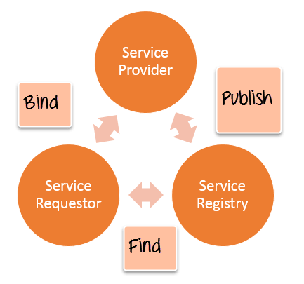

# A. Learn Web Service

## 1. Introduction web service

Web Service cung cấp tài nguyên ứng dụng phần mềm qua mạng bằng các công nghệ tiêu chuẩn. Bởi vì các Web Service dựa trên các giao diện tiêu chuẩn, chúng có thể giao tiếp ngay cả khi chúng đang chạy trên các hệ điều hành khác nhau và được viết bằng các ngôn ngữ khác nhau. Vì lý do này, chúng là một cách tiếp cận tuyệt vời để xây dựng các ứng dụng phân tán phải kết hợp các hệ thống đa dạng qua mạng.

## 2. What web service?

Webservice là tập hợp các giao thức và tiêu chuẩn mở được sử dụng để trao đổi dữ liệu giữa các ứng dụng hoặc giữa các hệ thống. Tóm gọm

+ Là phương thức giao tiếp giữa hai thiết bị qua mạng.
+ Là ứng dụng hoặc thành phần ứng dụng để giao tiếp.
+ Là tập hợp các tiêu chuẩn hoặc giao thức để trao đổi thông tin giữa hai thiết bị hoặc ứng dụng.

Các ứng dụng phần mềm được viết bằng các ngôn ngữ lập trình khác nhau và chạy trên các nền tảng khác nhau, có thể sử dụng các dịch vụ web để trao đổi dữ liệu qua mạng máy tính.

Web service hoạt động một cách độc lập không phụ thuộc bất kỳ ngôn ngữ nào. Các ứng dụng java, .net hoặc PHP… có thể giao tiếp với các ứng dụng khác thông qua web service.

## 3. Web service architecture

Kiến trúc Web service bao gồm 3 vai trò riêng biệt:

+ **Provider**: Nhà cung cấp tạo dịch vụ web và cung cấp dịch vụ này cho ứng dụng khách muốn sử dụng.
+ **Requestor**: Người yêu cầu không là gì khác ngoài ứng dụng khách cần liên hệ với một dịch vụ web. Ứng dụng khách có thể là .Net, Java hoặc bất kỳ ứng dụng dựa trên ngôn ngữ nào khác tìm kiếm một số loại chức năng thông qua web service.
+ **Broker**: Nhà môi giới không là gì ngoài ứng dụng cung cấp quyền truy cập vào UDDI (UDDI cho phép ứng dụng khách định vị dịch vụ web).

Web Services Architecture

Sơ đồ bên dưới trình bày cách nhà cung cấp Dịch vụ (Provider), người yêu cầu Dịch vụ (Requestor) và sổ đăng ký Dịch vụ (Service registry) tương tác với nhau.

+ **Publish**: Nhà cung cấp (Provider) thông báo cho nhà môi giới (Service Registry) về sự tồn tại của web service bằng cách sử dụng giao diện xuất bản của nhà môi giới (Broker) để làm cho khách hàng có thể truy cập dịch vụ
+ **Find**: Người yêu cầu tư vấn cho nhà môi giới để tìm một dịch vụ web đã xuất bản.
+ **Bind**: Với thông tin thu được từ nhà môi giới (đăng ký dịch vụ) về dịch vụ web, người yêu cầu có thể liên kết hoặc gọi dịch vụ web.

## 4. Learn about web service components(XML-RPC, SOAP, WSDL, UDDI)

Nền tảng web service cơ bản là XML HTTP. Tất cả các web service chuẩn đều hoạt động bằng các thành phần sau:

+ XML-RPC: Đây là giao thức dựa trên XML đơn giản nhất để trao đổi thông tin giữa các máy tính.

    + XML-RPC là một giao thức đơn giản sử dụng các thông điệp XML để thực hiện các RPC.

    + Các yêu cầu được mã hóa bằng XML và được gửi qua HTTP POST.

    + Các phản hồi XML được nhúng trong phần nội dung của phản hồi HTTP.

    + XML-RPC độc lập với nền tảng.

    + XML-RPC cho phép các ứng dụng đa dạng giao tiếp.

    + Máy khách Java có thể nói XML-RPC với máy chủ Perl.

    + XML-RPC là cách dễ nhất để bắt đầu với các dịch vụ web.

+ SOAP (là viết tắt của Simple Object Access Protocol) – giao thức truy cập đối tượng đơn giản: SOAP là một giao thức dựa trên XML đơn giản cho phép các ứng dụng trao đổi thông tin qua HTTP.
  
    + SOAP là một giao thức truyền thông.

    + SOAP là để giao tiếp giữa các ứng dụng.

    + SOAP là một định dạng để gửi tin nhắn.

    + SOAP được thiết kế để giao tiếp qua Internet.

    + SOAP độc lập với nền tảng.

    + SOAP là ngôn ngữ độc lập.

    + SOAP rất đơn giản và có thể mở rộng.

    + SOAP cho phép bạn vượt qua tường lửa.

    + SOAP sẽ được phát triển như một tiêu chuẩn W3C.

W3C là một chuẩn trong thiết kế website hiện nay, tuy nhiên nó không tham gia vào tất cả các vai trò của diễn ra trên website  mà vai trò chính của nó chính là giúp các nhà thiết kế website định hướng xây dựng, phát triển tốt cho webiste của mình.

**Chuẩn chính thức của W3C sẽ cần phải trãi qua 4 giai đoạn bao gồm:**

+   Giai đoạn 1: Working Draft – Giai đoạn phát thảo
+   Giai đoạn 2: Last Call – chỉnh sửa cuối cùng
+   Giai đoạn 3: Proposed Recommendation – Trình chuẩn
+   Giai đoạn 4: Candidate Recommendation – Chuẩn đủ tư cách ứng xử

    
+ UDDI (Universal Description, Discovery and Integration): UDDI là một tiêu chuẩn dựa trên XML để mô tả, xuất bản và tìm kiếm các dịch vụ web.

    + UDDI là viết tắt của Universal Description, Discovery và Integration.

    + UDDI là một đặc điểm kỹ thuật cho một sổ đăng ký phân tán của các dịch vụ web.

    + UDDI là một khuôn khổ mở, độc lập với nền tảng.

    + UDDI có thể giao tiếp thông qua SOAP, CORBA và Java RMI Protocol.

    + UDDI sử dụng WSDL để mô tả giao diện cho các dịch vụ web.

    + UDDI được xem cùng với SOAP và WSDL là một trong ba tiêu chuẩn nền tảng của các dịch vụ web.

    + UDDI là một sáng kiến ​​trong ngành công nghiệp mở cho phép các doanh nghiệp khám phá lẫn nhau và xác định cách họ tương tác qua Internet.

+ WSDL (Web Services Description Language) – ngôn ngữ định nghĩa web service: WSDL là một ngôn ngữ dựa trên XML để mô tả các dịch vụ web và cách truy cập chúng.

    + WSDL là viết tắt của Ngôn ngữ Mô tả Dịch vụ Web.

    + WSDL được phát triển chung bởi Microsoft và IBM.

    + WSDL là một giao thức dựa trên XML để trao đổi thông tin trong các môi trường phân tán và phi tập trung.

    + WSDL là định dạng tiêu chuẩn để mô tả một dịch vụ web.

    + Định nghĩa WSDL mô tả cách truy cập một dịch vụ web và những hoạt động mà nó sẽ thực hiện.

    + WSDL là một ngôn ngữ để mô tả cách giao tiếp với các dịch vụ dựa trên XML.

    + WSDL là một phần không thể thiếu của UDDI, một cơ quan đăng ký kinh doanh trên toàn thế giới dựa trên XML.

    + WSDL là ngôn ngữ mà UDDI sử dụng.

    + WSDL được phát âm là 'wiz-dull' và được đánh vần là 'W-S-D-L'.

## 5. Learn about web service security

Bảo mật là rất quan trọng đối với các dịch vụ web. Tuy nhiên, cả đặc tả XML-RPC và SOAP đều không đưa ra bất kỳ yêu cầu xác thực hoặc bảo mật rõ ràng nào.

Có ba vấn đề bảo mật cụ thể với các dịch vụ web

+ Confidentiality (Bảo mật)
+ Authentication (Xác thực)
+ Network Security (An ninh mạng)

### Bảo mật (Confidentiality)

Nếu một khách hàng gửi một yêu cầu XML đến một máy chủ, chúng tôi có thể đảm bảo rằng thông tin liên lạc vẫn được bảo mật không?

Câu trả lời nằm ở đây

+ XML-RPC và SOAP chủ yếu chạy trên HTTP.

+ HTTP có hỗ trợ cho Lớp cổng bảo mật (SSL).

+ Thông tin liên lạc có thể được mã hóa qua SSL.

+ SSL là một công nghệ đã được chứng minh và triển khai rộng rãi.

Một dịch vụ web có thể bao gồm một chuỗi các ứng dụng. Ví dụ, một dịch vụ lớn có thể liên kết các dịch vụ của ba ứng dụng khác lại với nhau. Trong trường hợp này, SSL không đủ; các thông điệp cần được mã hóa tại mỗi nút dọc theo đường dẫn dịch vụ và mỗi nút đại diện cho một liên kết yếu tiềm ẩn trong chuỗi. Hiện tại, không có giải pháp nào được thống nhất cho vấn đề này, nhưng một giải pháp đầy hứa hẹn là Tiêu chuẩn mã hóa XML W3C. Tiêu chuẩn này cung cấp một khuôn khổ để mã hóa và giải mã toàn bộ tài liệu XML hoặc chỉ các phần của tài liệu XML.

### Xác thực (Authentication)

Nếu một khách hàng kết nối với một dịch vụ web, làm cách nào để chúng tôi xác định được người dùng đó? Người dùng có được phép sử dụng dịch vụ không?

Các tùy chọn sau đây có thể được xem xét nhưng không có sự đồng thuận rõ ràng về một sơ đồ xác thực mạnh.

+ HTTP bao gồm hỗ trợ tích hợp cho xác thực Cơ bản và Thông báo và do đó, các dịch vụ có thể được bảo vệ theo cách giống như các tài liệu HTML hiện đang được bảo vệ.

+ Chữ ký số SOAP (SOAP-DSIG) sử dụng mật mã khóa công khai để ký điện tử các thông điệp SOAP. Nó cho phép máy khách hoặc máy chủ xác thực danh tính của bên kia.

+ (The Organization for the Advancement of Structured Information Standards) Tổ chức vì sự tiến bộ của tiêu chuẩn thông tin có cấu trúc (OASIS) đang nghiên cứu về Ngôn ngữ đánh dấu xác nhận bảo mật (SAML).

### An ninh mạng (Network Security)

Hiện tại không có câu trả lời dễ dàng cho vấn đề này, và nó đã là chủ đề của nhiều cuộc tranh luận. Hiện tại, nếu bạn thực sự có ý định lọc ra các thông báo SOAP hoặc XML-RPC, một khả năng là lọc ra tất cả các yêu cầu HTTP POST đặt loại nội dung của chúng thành text / xml.

Một giải pháp thay thế khác là lọc thuộc tính tiêu đề SOAPAction HTTP. Các nhà cung cấp tường lửa hiện cũng đang phát triển các công cụ được thiết kế rõ ràng để lọc lưu lượng dịch vụ web.