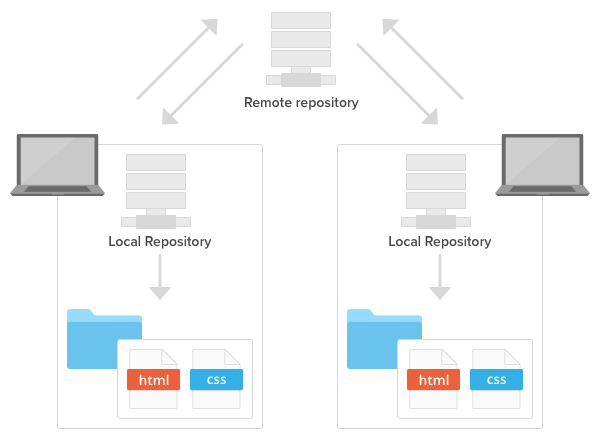
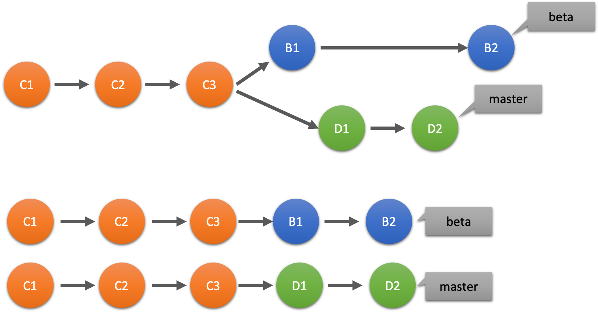
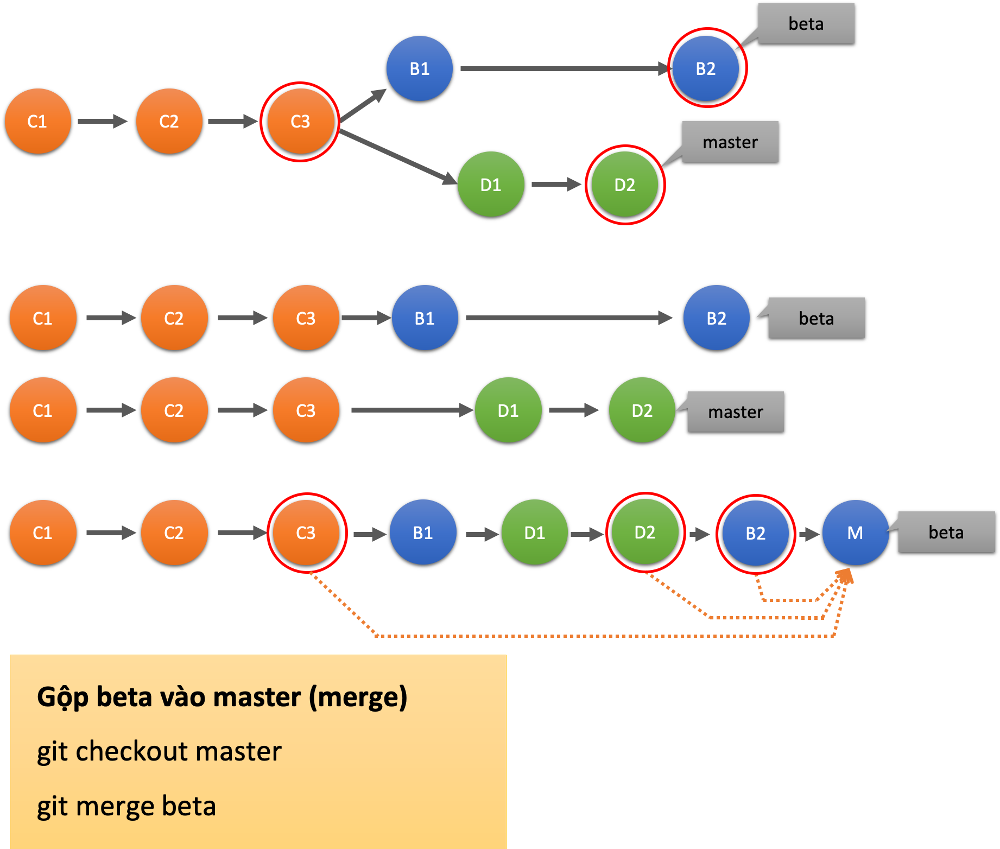
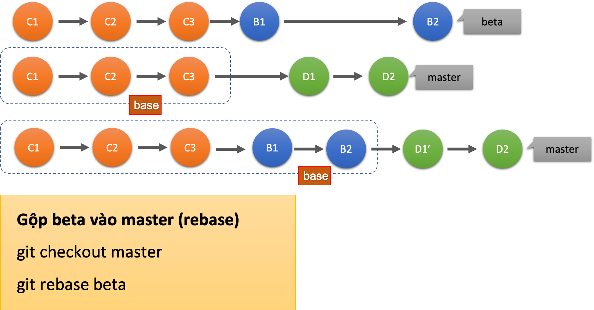
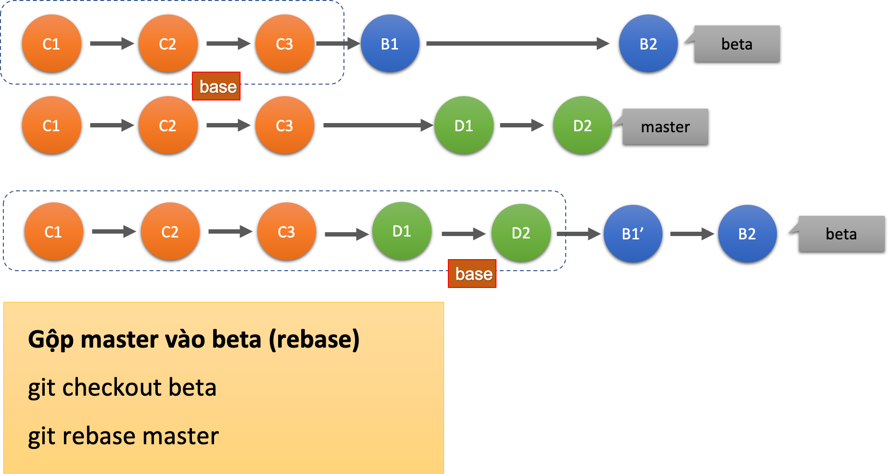

# Git là gì?

>"Git là một hệ thống quản lý phiên bản phân tán".

Git chủ yếu được dùng để lưu trữ source code và toàn bộ lịch sử thay đổi của nó. Ngoài ra Git có Remote Repository (repo được lưu trên server) và Local Repository (repo được lưu trên máy tính cá nhân của các devlopers), nó cho phép chúng ta truy suât source code ở bất cứ đâu. 



## 1. Git lưu trữ code và lịch sử như thế nào.


>Git coi dữ liệu của nó giống như một loạt ảnh chụp nhanh của một hệ thống tệp thu nhỏ. Với Git, mỗi khi bạn cam kết hoặc lưu trạng thái dự án của mình, về cơ bản, Git sẽ chụp ảnh tất cả các tệp của bạn trông như thế nào tại thời điểm đó và lưu trữ tham chiếu đến ảnh chụp nhanh đó. Để hiệu quả, nếu các tệp không thay đổi, Git sẽ không lưu trữ lại tệp, chỉ là một liên kết đến tệp giống hệt trước đó mà nó đã lưu trữ. Git nghĩ về dữ liệu của nó giống như một luồng ảnh chụp nhanh.

## 2. Ba trạng thái khi làm việc với git

Khi làm việc với Git, các files sẽ có 1 trong 3 trạng thái sau: **modified**, **staged**, and **committed**.

+ Modified: bạn thay đổi file nhưng chưa add vào staged, hoặc commit.
+ Staged: bạn thay đổi file và đánh dấu thay đổi này sẽ được bao gồm trong commit sắp tới.
+ Committed: data đã được lưu trữ trên local database.


+    Working Directory: một phiên bản của project. Những file này đc pulled out từ Git directory và place on disk để chúng ta có thể thay đổi.
+    Staging Area: là 1 file được lưu trong git directory, lưu trữ thông tin cho lần commit sắp tới. (file này có tên là index trong .git folder)
+   Git directory: nơi git lưu trữ metadata và object database của project.

# Các câu lệnh trong git

## 1. Tạo repo

### TH1: Tạo project mới

Khởi tạo repo với tên mình đặt
```git
git init learn_git
```
Khi thực thi một folder mới tên learn_git được tạo ra chứa file .git bên trong.

### TH2: Clone project về máy

Thực thi câu lệnh

    git clone <url>

Nếu muốn folder clone về có tên khác

    git clone <url> new_name

## 2. Cách tạo nhánh

+ Tạo nhánh mới ở local và chuyển sang nhánh vừa tạo

        git checkout -b nhanh-moi

+ Chuyển sang nhánh khác
        
        git checkout nhanh-khac

+ Tải dữ liệu từ Remote Repo

        git fetch

+ Để kéo toàn bộ code mới được merge vào nhánh hiện tại đang đứng

        git pull

## 3. Config

+    Đảm bảo đúng account, git config --list để xem info
+    Để thay đổi config account

    git config --global user.name "Name"
    git config --global user.email "Email"

## 4. Cách commit, push code

+ Trước khi commit cần compare toàn bộ các file thay đổi, stage file

        git status

* Add tất cả file thay đổi vào staging area

        git add .

+ Commit

        git commit -m "Nội dung commit"

+ push lên nhánh làm việc của mình trên remote repo

        git push origin branch_name

## 5. Hoàn tác commit

Reset commit sẽ có 3 option

+ Reset commit nhưng code vẫn ở trong staging area, sẵn sàng để commit lại

        git reset --soft HEAD~

+ Reset commit và đẩy code ra khỏi staging area, nhưng vẫn lưu thay đổi của code trong local repo

        git reset --mixed HEAD~

+ Reset commit và xóa toàn bộ code đã làm (hạn chế dùng)

        git reset --hard HEAD~

HEAD là commit mới nhất hiện tại (latest commit)

HEAD~1 (hoặc HEAD~) là 1 commit phía trước commit mới nhất (one commit before HEAD)

HEAD~2 (two commits before HEAD)

## 6. Stash

Stash được sử dụng khi muốn lưu lại các thay đổi chưa commit, thường hữu dụng khi đổi sang 1 branch khác mà lại đang làm dở ở branch hiện tại.

Stash sẽ được lưu lại như 1 phần tử trong 1 stack
**Lưu lại thay đổi**

Lưu toàn bộ nội dung công việc đang làm dở

        git stash

**Lấy lại thay đổi**

Sau khi đã stash 1 hoặc vài lần, ta có thể xem lại danh sách cần lưu thay đổi bằng câu lệnh

        git stash list

Nếu muốn xem cả nội dung của từng thay đổi

        git stash list -p

Xem nội dung cụ thể của lần thay đổi thứ n

        git stash show stash@{n}

Apply lại những thay đổi được lưu gần nhất (xóa stash được chọn khỏi stack)

        git stash pop "stash@{n}"

Apply lại những thay đổi ở lần thứ n (không xóa stash được chọn khỏi stack)

        git stash apply "stash@{n}"

Nếu sử dụng git apply và muốn xóa stash khỏi stack

        git stash drop "stash@{n}"

Như vậy: `git stash pop` = `git stash apply` + `git stash drop`

## 7. Merge và Rebase

### 7.1. Merge

Lệnh `git merge` sử dụng để gộp nhánh, gộp nhánh này vào nhánh khác. Khi gộp nhánh git thường căn cứ vào 3 commit, để tạo ra một commit gộp, nếu có xung đột cần xử lý

Giả sử có hai nhánh master và beta như sau:



Để gộp các commit trong nhánh beta vào nhánh master thì chuyển làm việc trên master và thực hiện lệnh:

    git merge beta

Sơ đồ và kết quả của lệnh git merge như hình sau:



### 7.1. Rebase

Lệnh `git rebase` cũng gộp các commit từ nhánh này vào nhánh khác, bằng cách xây dựng lại các commit base kế thừa từ nhánh khác và viết lại lịch sử commit sau các commit cơ sở mới.

Ví dụ, để gộp nhánh beta vào master, đứng ở master thực hiện lệnh

    git rebase beta



Như trên hình trên, trước thời điểm rebase, nhánh master có các commit cơ sở giống với nhánh beta đó là: C1, C2, C2

Lệnh `git rebase` sẽ đưa toàn bộ nhánh beta làm base của master, do vậy các commit tiếp theo sau commit cơ sở ban đầu của master sẽ được nối tiếp vào, trong đó có thay đổi lại lịch sử commit, cũng sử lý xung đột giữa commit B2 và D1 để viết lại commit D1 thành D1'

Tương tự, nếu gộp master vào beta thì sơ đồ có thể là:



# Bắt đầu dự án
Lấy source code của team lưu về máy:

```git
git clone <url>
```

Nếu muốn tên folder sau khi clone khác với tên project trên remote

```git
git clone <url> folder_name
```

# Thực hiện dự án
## Quá trình code
Checkout về branch chính của team (thông thường là branch master)

```git
git checkout master
```

Pull code mới nhất về

```git
git pull origin master
```

Kiểm tra code ở local đã update chưa

```git
git log --oneline --graph
```

Định dạng cách hiển thị log (sử dụng alias)

```git
git config --global alias.logstyle "log --graph --decorate --pretty=oneline --abbrev-commit --all"
```

Sử dụng alias

```git
git logstyle
```

Alias có tên là `logstyle`

Các flag được sử dụng
- `--graph` : Hiển thị commit history tree dưới dạng graph
- `--decorate` : Mặc định là short (chỉ in tên của branch và tag thay vì in đủ ref name)
- `--pretty=online` : In thông tin commit log theo quy tắc (ở đây là in 1 dòng)
- `--abrev-commit` : Rút gọn mã của lần commit (40-byte hexadecimal)
- `--all` : Hiện tất cả các local branch

Checkout ra một branch mới để bắt đầu làm feature của mình. Lệnh này sẽ tạo branch mới và checkout sang branch đó luôn

```git
git checkout -b feature_branch
```

## Sau khi code
Add các file đã sửa vào staging area

```git
git add .
```

Sau đó, commit

```git
git commit -m "Fix all bugs"
```

**Note:** Cách đặt tên branch và commit nên rõ ràng, thể hiện branch đó, commit đó thực hiện feature gì hay là fix bug gì

Cuối cùng, push code lên  nhánh riêng của mình trên remote repository

```git
git push origin feature_branch
```

Sau đó, lên repository, tạo merge request cho PM review

## Feature có nhiều người làm
Nếu branch có nhiều người làm chung, bạn chưa kịp push code đã có người khác push trước. Vậy thì trước khi push hãy pull theo cách này

```git
git pull --rebase
```

Commit của bạn sẽ được đẩy lên trên commit của đồng nghiệp trong log. Trong trường hợp bạn muốn lấy code về nhưng chưa muốn merge thì dùng lệnh

```git
git fetch
```

Có thể hiểu: `pull = fetch + merge`

## Merge code
Sau một hồi review thì sếp đồng ý cho bạn merge code, nhưng vấn đề là trong quá trình review thì bạn có thêm một vài commit để thêm, sửa, xóa file. Bạn muổn rebase những commit đó lại thành 1, hoặc đơn giản chỉ muốn sửa trên hay xóa commit nào đó.

Giả sử bạn có 3 commit cần hợp nhất

```git
git rebase -i HEAD~3
```

Terminal hiện ra nhiều option: edit, reword, squash, ... Thay chữ pick ở đầu dòng bằng option tương ứng mà bạn muốn dùng. Sau đó, bấm Ctrl + O để ghi đè, tiếp tục Ctrl + X để thoát

Còn một vấn đề nữa là branch master đã có người khác push thêm code. Bạn vẫn có thể merge, nhưng nó sẽ tạo ra 1 commit merge. Vậy nên ta sẽ rebase và merge fast forward. Đầu tiên, vẫn là:

```git
git fetch
```

Sau đó là lệnh rebase. Bạn phải đứng ở feature_branch để thực hiện lệnh này

```git
git rebase master
```

Lệnh rebase sẽ giúp ta lấy những code mới nhất từ branch master về, sau đó "viết lại" branch feature của ta để đẩy commit của bạn lên trên cùng. Cuối cùng là push force lên feature branch. Push force sẽ apply toàn bộ log ở local của bạn lên branch ở repo, bất chấp log 2 nơi khác nhau

```git
git push -f origin feature_branch
```

Nếu branch một mình làm có thể push force thoải mái. Nhưng **cân nhắc cẩn thận khi push force lên branch có nhiều người làm chung**, vì nó dễ gây conflict cho người khác. Chỉ làm điều này khi đã chắc chắn hoàn thiện feature của mình

Sau đó merge code ở merge request trên repo. Vậy là hoàn thành task đầu tiên.

# Trường hợp bị lỗi
## Reset
Trong quá trình làm có thể xảy ra nhầm lẫn và cần revert code. Git reset sẽ có 3 option dành cho bạn

Reset commit nhưng code vẫn ở trong stage, sẵn sàng để commit lại

```git
git reset --soft HEAD~1
```

Reset commit và đẩy code ra khỏi stage (xóa khỏi Git index), nhưng vẫn lưu thay đổi trong code ở local repo. Bạn cần dùng git add trước khi có thể commit lại

```git
git reset --mixed HEAD~1
```

Reset commit và xóa toàn bộ code bạn đã làm (hạn chế dùng)

```git
git reset --hard HEAD~1
```

`HEAD` ám chỉ commit mới nhất hiện tại (latest commit)

`HEAD~1` ám chỉ 1 commit phía trước commit mới nhất (one commit before HEAD)

`HEAD~2` (two commits before HEAD)

## Stash
Bạn có thể dùng cái này như một cứu cánh để lưu tạm code trước khi thực hiện các lệnh rebase hay checkout sang branch khác mà bị conflict. Bạn cứ tưởng tượng nó như một tờ giấy nháp lưu theo cấu trúc stack vậy

Khi muốn lưu tất cả những thay đổi hiện tại vào stash

```git
git stash
```

Khi muốn apply stash cuối cùng vừa lưu

```git
git stash pop
```